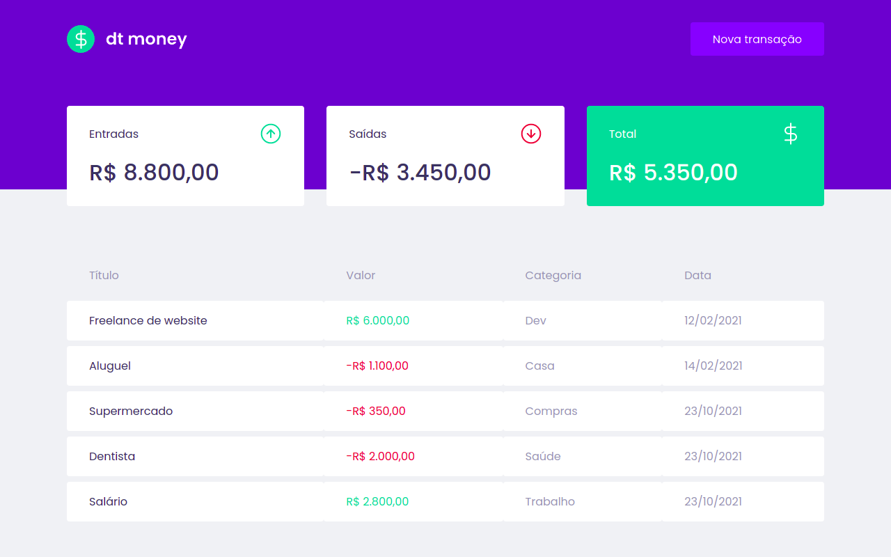

# ReactJS - dtmoney


Aplicação front-end web completa desenvolvida na trilha ReactJS do Ignite da RocketSeat.

# Alguns dos conceitos utilizados nesse projeto

- Styled Components;
- MirageJS;
- Context API;
- Hooks;
- Axios.

# Screenshot



## Instalação

1. Utilize o Git para clonar o projeto para o seu repositório local

```
git clone https://github.com/CamposCaio/reactjs-dtmoney.git
```

2. Acesse o diretório do projeto recém criado

```
cd reactjs-dtmoney/
```

3. Instale as dependencias do projeto

```
yarn
```

4. Inicialize a aplicação

```
yarn start
```

5. Acesse [http://localhost:3000](http://localhost:3000) para visualizá-la no browser.
